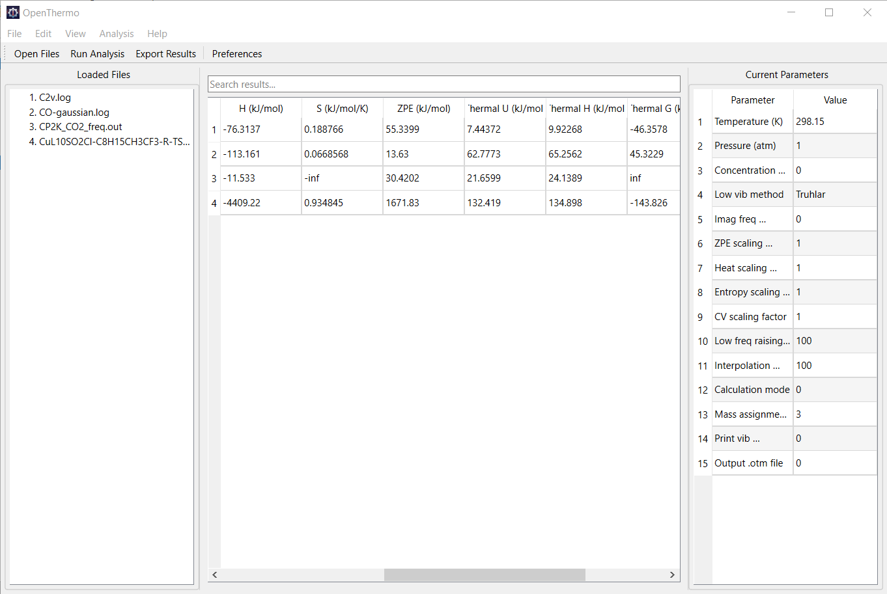

<p align="center">
  <a href="https://github.com/lenhanpham/OpenThermo">
    <picture>
      
    </picture>
  </a>
</p>
<p align="center">
  <a href="https://en.cppreference.com/w/cpp/17">
    
  </a>
  <a href="./LICENSE">
    
  </a>
  
</p>

**OpenThermoGUI** is a graphical user interface version of OpenThermo. The GUI version is intent on making OpenThermo user friendly when it runs on Laptop, PC, and Macbook. GUI is underdevelopment and **not ready for use yet**. All terminal functions are working normally.



# Important Note

**The project is still in the early stage and not fully tested. Therefore, errors and inaccuracy may happen. Users are suggested to check calculated data against original data from outputs of corresponding quantum chemical programs (with default temperature, conentration, and pressure)**

## Table of Contents

1. [Project Overview](#project-overview)
2. [Key Features](#key-features)
3. [System Requirements](#system-requirements)
4. [Installation](#installation)
5. [Configuration](#configuration)
6. [Usage](#usage)
7. [Input Formats](#input-formats)
8. [Output Formats](#output-formats)
9. [Calculation Methods](#calculation-methods)
10. [Advanced Features](#advanced-features)
11. [Examples](#examples)
12. [Troubleshooting](#troubleshooting)
13. [Contributing](#contributing)
14. [License](#license)

## Project Overview

**OpenThermo** is a high-performance C++17 program designed for molecular thermochemistry calculations. It processes quantum chemistry output files to compute thermodynamic properties using rigorous statistical mechanics methods. The program supports multiple quantum chemistry packages and implements both standard and advanced treatment methods for accurate thermochemical analysis.

### Purpose

OpenThermo addresses the need for accurate thermochemical data in computational chemistry without re-running quantum chemical programs by providing:

- **Accurate thermodynamic calculations** using statistical mechanics
- **Multiple treatment methods** for low-frequency vibrational modes
- **Comprehensive analysis** of molecular systems
- **Batch processing capabilities** for high-throughput workflows
- **Extensible architecture** for future enhancements

### Architecture

The codebase is organized into modular components located in the `src/` directory:

```
src/
├── gui
│   ├── settingsdialog.cpp
│   ├── settingsdialog.h
│   ├── ui.cpp
│   └── ui.h
├── atommass.cpp
├── atommass.h
├── calc.cpp
├── calc.h
├── chemsys.h
├── help_utils.cpp
├── help_utils.h
├── loadfile.cpp
├── loadfile.h
├── main.cpp
├── symmetry.cpp
├── symmetry.h
├── util.cpp
└── util.h
```

### Development Status

- **Version**: 0.001.1
- **Language**: C++17 with clang++ compiler
- **Build System**: GNU Make with CMake support
- **Testing**: Comprehensive test suite with sample files
- **Documentation**: Doxygen-generated API documentation

## Key Features

### Core Functionality

- **Graphical user interface**: Underdevelopement 
- **Terminal interface**: Full functions
- **Multi-format Support**: Gaussian, ORCA, GAMESS-US, NWChem, CP2K, VASP
- **Advanced Thermochemistry**: Standard RRHO and quasi-RRHO treatments for low-frequency modes
- **Statistical Mechanics**: Rigorous implementation of partition functions and thermodynamic properties
- **Symmetry Analysis**: Automatic point group detection and rotational symmetry number calculation

### Calculation Methods

- **Standard RRHO**: Rigid-rotor harmonic oscillator approximation
- **Quasi-RRHO Treatments**:
  - Truhlar's frequency raising method
  - Grimme's entropy interpolation
  - Minenkov's energy interpolation
- **Electronic Contributions**: Multi-level electronic structure support
- **Concentration Corrections**: Solution-phase Gibbs energy adjustments

### Flexibility & Usability

- **Temperature/Pressure Scanning**: Automated parameter sweeps
- **Batch Processing**: Multi-file analysis with ensemble averaging
- **Mass Modifications**: Isotopic substitution and custom atomic masses
- **Configurable Scaling**: Frequency scaling factors for different properties
- **Multiple Output Formats**: Console, text files, and native OpenThermo format

### Technical Excellence

- **High Performance**: Optimized C++17 implementation
- **Memory Efficient**: Minimal memory footprint for large systems
- **Error Handling**: Comprehensive validation and graceful error recovery
- **Extensible Design**: Modular architecture for easy enhancement
- **Cross-Platform**: Linux, macOS, and Windows support

## System Requirements

### Minimum Requirements

- **Operating System**: Linux, macOS 10.14+, or Windows 10+
- **Processor**: x86_64 architecture
- **Memory**: 512 MB RAM (2 GB recommended)
- **Storage**: 50 MB free space

### Compiler Requirements

- **Primary**: Clang 6.0+ or GCC 7.0+
- **Alternative**: Intel C++ Compiler 18.0+
- **Standard**: C++17 compliant compiler

### Build Dependencies

- **GNU Make**: 3.8.1+ (build system, tested)
- **CMake**: 3.26.5+ (alternative build system, tested)
- **Standard Library**: C++17 standard library

### Optional Dependencies

- **Doxygen**: 1.8+ (documentation generation)
- **Graphviz**: For documentation diagrams
- **Python**: 3.6+ (for test automation scripts)

### Supported Platforms

- **Linux**: Ubuntu 18.04+, CentOS 7+, Fedora 28+
- **macOS**: 10.14+ with Xcode Command Line Tools
- **Windows**: 10+ with MSYS2/MinGW or Visual Studio 2017+

## Installation

### Quick Start Build

1. **Clone or download the repository:**
   
   ```bash
   git clone https://github.com/lenhanpham/OpenThermo.git
   cd OpenThermo
   ```

2. **Build with Make (recommended):**
   
   ```bash
   make clean && make
   ```

3. **Alternative CMake build:**
   
   ```bash
   mkdir build && cd build
   cmake ..
   make
   ```

### Build Options

#### GNU Make Build System

```bash
# Standard optimized build
make

# Debug build with AddressSanitizer
make debug

# Release build with maximum optimization
make release

# Force specific compiler
make CXX=g++      # GCC
make CXX=clang++  # Clang
make CXX=icpc     # Intel

# Clean build artifacts
make clean
```

#### CMake Build System

```bash
# Create build directory
mkdir build && cd build

# Configure and build
cmake ..
make

# Build types
cmake .. -DCMAKE_BUILD_TYPE=Release
cmake .. -DCMAKE_BUILD_TYPE=Debug

# Specify compiler
cmake .. -DCMAKE_CXX_COMPILER=clang++
```

### Post-Build Setup

1. **Verify executable:**
   
   ```bash
   ./build/OpenThermo --help
   ```

2. **Create settings file (optional):**
   
   ```bash
   ./build/OpenThermo --create-config
   ```

3. **Compiler options:**
   
   ```bash
   make CXX=g++     # Force GCC compilation
   make CXX=icpc    # Force Intel compiler
   ```

4. **Clean build:**
   
   ```bash
   make clean
   ```

### Build Targets

- `all` (default): Standard optimized build
- `debug`: Includes debug symbols and AddressSanitizer
- `release`: Maximum optimization for production use
- `clean`: Remove all build artifacts

### Successful Compilation Output

```
Using compiler: g++
g++ -std=c++17 -Wall -Wextra -O2 -c main.cpp -o build/main.o
g++ -std=c++17 -Wall -Wextra -O2 -c atommass.cpp -o build/atommass.o
...
g++ build/main.o ... -o OpenThermo -lrt -lstdc++fs
```

## Configuration

### Configuration Files

OpenThermo supports configuration through:

1. **Command-line arguments** (highest priority)
2. **Local settings file**: `./settings.ini`
3. **Environment settings**: `$OPENTHERMOPATH/settings.ini`
4. **Program defaults** (lowest priority)

### Creating Settings File

Generate a default settings file:

```bash
./build/OpenThermo --create-config
```

This creates `settings.ini` with all available parameters and their default values.

### Settings File Format

```ini
# OpenThermo Settings File
# Lines starting with # are comments

# Electronic energy override
E = -76.384729

# Temperature settings (K)
T = 298.15
# For temperature scan: T = 200.0 400.0 25.0

# Pressure settings (atm)
P = 1.0
# For pressure scan: P = 0.5 2.0 0.2

# Frequency scaling factors
sclZPE = 1.0      # Zero-point energy scaling
sclheat = 1.0     # Thermal energy scaling
sclS = 1.0        # Entropy scaling
sclCV = 1.0       # Heat capacity scaling

# Low frequency treatment
lowvibmeth = Grimme  # 0/Harmonic=RRHO, 1/Truhlar, 2/Grimme, 3/Minenkov
ravib = 100.0     # Raising threshold for Truhlar method
intpvib = 100.0   # Interpolation threshold for Grimme/Minenkov

# Calculation options
ipmode = 0         # 0=gas phase, 1=condensed phase
imagreal = 0.0    # Imaginary frequency threshold
massmod = 3       # Mass assignment: 1=average, 2=abundant, 3=file
PGlabel = "?"     # Point group (auto-detect if "?")

# Output options
prtvib = 0        # Vibration contributions: 0=no, 1=screen, -1=file
outotm = 0        # Output .otm file: 0=no, 1=yes

# Concentration (for solution phase)
conc = 1.0

# VASP energy selection
# false/no/0 = energy  without entropy (default), true/yes/1 = energy(sigma->0)
extrape = false


# Mass modifications (optional section)
# modmass
# 1 H 1.007825  # Atom 1: Hydrogen with specific mass
# 2 C 12.0      # Atom 2: Carbon-12 isotope
```

### Parameters

| Parameter    | Meaning                                                          | Default Value |
| ------------ | ---------------------------------------------------------------- | ------------- |
| `conc`       | Concentration string for solution phase Gibbs energy corrections | `0`           |
| `prtvib`     | Print vibration contributions (0=no, 1=screen, -1=file)          | `0`           |
| `lowvibmeth` | Low frequency treatment method                                   | `2`           |
| `massmod`    | Mass assignment mode (1=average, 2=abundant, 3=file)             | `3`           |
| `outotm`     | Output .otm file flag (0=no, 1=yes)                              | `0`           |
| `ipmode`     | Calculation mode (0=gas phase, 1=condensed phase)                | `0`           |
| `T`          | Temperature in Kelvin                                            | `298.15`      |
| `P`          | Pressure in atmospheres                                          | `1.0`         |
| `sclZPE`     | ZPE scaling factor                                               | `1.0`         |
| `sclheat`    | Thermal energy scaling factor                                    | `1.0`         |
| `sclS`       | Entropy scaling factor                                           | `1.0`         |
| `sclCV`      | Heat capacity scaling factor                                     | `1.0`         |
| `ravib`      | Raising threshold for Truhlar method (cm⁻¹)                      | `100.0`       |
| `intpvib`    | Interpolation threshold for Grimme/Minenkov (cm⁻¹)               | `100.0`       |
| `imagreal`   | Imaginary frequency threshold (cm⁻¹)                             | `0.0`         |
| `Eexter`     | External electronic energy override (a.u.)                       | `0.0`         |
| `extrape`    | VASP electronic energy selection                                 | `false`       |
| `PGlabel`    | Point group label ("?" for auto-detect)                          | `"?"`         |

**Details for `extrape`:**

- `false/no/0` → energy without entropy  
- `true/yes/1` → energy (σ→0)

**Details for `lowvibmeth`:**

- 0/Harmonic = Rigid-Rotor Harmonic Oscillator approximation (RRHO)
- 1/Truhlar =  Truhlar's QRRHO method
- 2/Grimme = Grimme's method
- 3/Minenkov = Minenkov's method

### Parameter Precedence

1. **Command-line arguments** (highest priority)
2. **Current directory** `settings.ini`
3. **Environment path** `settings.ini`
4. **Program defaults** (lowest priority) 

### Environment Variables

- **`OPENTHERMOPATH`**: Directory containing `settings.ini`
- **`OPENTHERMO_OUTPUT`**: Default output directory

### Configuration Priority

Settings are applied in this order:

1. Command-line arguments override everything
2. Current directory `settings.ini`
3. Environment path `settings.ini`
4. Built-in program defaults

### Command Line Options

### Input and Output Options

#### `-E <value>`

- **Description**: Override electronic energy
- **Units**: Atomic units (a.u.)
- **Default**: Use value from input file
- **Example**: `-E -76.384729`

#### `-T <T>` or `-T <T1 T2 step>`

- **Description**: Temperature specification
- **Units**: Kelvin (K)
- **Default**: 298.15 K
- **Examples**:
  - `-T 300` (single temperature)
  - `-T 200 400 25` (scan from 200K to 400K in 25K steps)

#### `-P <P>` or `-P <P1 P2 step>`

- **Description**: Pressure specification
- **Units**: Atmospheres (atm)
- **Default**: 1.0 atm
- **Examples**:
  - `-P 2.0` (single pressure)
  - `-P 0.5 2.0 0.2` (scan from 0.5 to 2.0 atm in 0.2 atm steps)

### Thermochemistry Options

#### `-sclZPE <factor>`

- **Description**: Scale factor for ZPE frequencies
- **Default**: 1.0
- **Example**: `-sclZPE 0.98`

#### `-sclheat <factor>`

- **Description**: Scale factor for thermal energy frequencies
- **Default**: 1.0
- **Example**: `-sclheat 0.99`

#### `-sclS <factor>`

- **Description**: Scale factor for entropy frequencies
- **Default**: 1.0
- **Example**: `-sclS 0.99`

#### `-sclCV <factor>`

- **Description**: Scale factor for heat capacity frequencies
- **Default**: 1.0
- **Example**: `-sclCV 0.99`

### Low Frequency Treatment Options

#### `-lowvibmeth <mode>`

- **Description**: Low frequency treatment method
- **Values**:
  - `0` or `Harmonic`: Standard RRHO (harmonic approximation)
  - `1` or `Truhlar`: Truhlar's QRRHO (frequency raising)
  - `2` or `Grimme`: Grimme's entropy interpolation
  - `3` or `Minenkov`: Minenkov's entropy + energy interpolation
- **Default**: Grimme
- **Example**: `-lowvibmeth 1` or `-lowvibmeth Truhlar`

#### `-ravib <value>`

- **Description**: Raising value for low frequencies (Truhlar's method)
- **Units**: cm⁻¹
- **Default**: 100.0
- **Example**: `-ravib 50.0`

#### `-ipmode <mode>`

- **Description**: Calculation mode
- **Values**:
  - `0`: Gas phase (include translational/rotational)
  - `1`: Condensed phase (remove translational/rotational)
- **Default**: 0
- **Example**: `-ipmode 1`

#### `-imagreal <value>`

- **Description**: Treat imaginary frequencies as real if |ν| < value
- **Units**: cm⁻¹
- **Default**: 0.0 (no treatment)
- **Example**: `-imagreal 50.0`

### Mass and Symmetry Options

#### `-massmod <type>`

- **Description**: Default atomic mass assignment
- **Values**:
  - `1`: Element average mass
  - `2`: Most abundant isotope mass
  - `3`: Masses from input file (default)
- **Default**: 3
- **Example**: `-massmod 2`

#### `-PGlabel <label>`

- **Description**: Force specific point group
- **Default**: Auto-detect
- **Example**: `-PGlabel C2v`

#### `-conc <string>`

- **Description**: Concentration specification
- **Default**: None
- **Example**: `-conc "2.5"`

### Output Control Options

#### `-prtvib <mode>`

- **Description**: Print vibration contributions
- **Values**:
  - `0`: No (default)
  - `1`: Yes, to screen
  - `-1`: Yes, to `basename.vibcon` file
- **Default**: 0
- **Example**: `-prtvib 1`

#### `-outotm <mode>`

- **Description**: Output OpenThermo format file
- **Values**:
  - `0`: No (default)
  - `1`: Yes
- **Default**: 0
- **Example**: `-outotm 1`

### Special Options

#### `-noset`

- **Description**: Skip loading settings from `settings.ini`
- **Example**: `-noset`

### Help Options

#### `--help`

- **Description**: Show general help
- **Example**: `./OpenThermo --help`

#### `--help-<option>`

- **Description**: Show help for specific option
- **Examples**:
  - `--help-T` (temperature help)
  - `--help-lowvibmeth` (low frequency help)
  - `--help-input` (input formats help)

## Input File Formats

### Supported Formats

#### 1. OpenThermo Format (.otm)

**Native format containing all molecular data:**

```text
*E  //Electronic energy (a.u.)
-76.384729

*wavenum  //Wavenumbers (cm^-1)
1234.5
2345.6
...

*atoms  //Name, mass (amu), X, Y, Z (Angstrom)
C   12.000000   0.000000   0.000000   0.000000
H    1.007825   0.000000   0.000000   1.089000
...

*elevel  //Energy (eV) and degeneracy
0.0 1
1.5 3
```

#### 2. Quantum Chemistry Output Files

##### Gaussian (.log, .out)

- **Requirements**: Frequency analysis output
- **Extracts**: Geometry, frequencies, electronic energy
- **Features**: Automatic format detection

##### ORCA (.out)

- **Requirements**: Frequency calculation results
- **Features**: Supports various ORCA output formats

##### GAMESS-US (.log)

- **Requirements**: Hessian/frequency analysis
- **Features**: Standard GAMESS output parsing

##### NWChem (.out)

- **Requirements**: Frequency analysis output
- **Features**: Comprehensive NWChem support

##### CP2K (.out)

- **Requirements**: Vibrational analysis output
- **Features**: Supports molecular and periodic systems
- **Note**: For condensed phase systems (ipmode=1): contributions of translation and rotation are ignored

##### VASP (OUTCAR)

- **Requirements**: Vibrational analysis output in OUTCAR, sysmtem information in CONTCAR
- **Features**: Supports molecular and periodic systems
- **Note**: For condensed phase systems (ipmode=1): contributions of translation and rotation are ignored

#### 3. List Files (.txt)

**Batch processing of multiple files:**

```text
molecule-a.log
molecule-b.out
/path/to/molecule-c.otm
```

### File Detection

- **Automatic**: Program detects format from file content
- **No manual specification** required
- **Priority**: OpenThermo → specific program signatures

## Output Files and Formats

### Console Output

```
OpenThermo: A general program for calculating molecular thermochemistry properties
Version 0.001.1  Release date:
Developer: Le Nhan Pham

Running parameters:
 Temperature: 298.15 K
 Pressure: 1.0 atm
 Scale factor of vibrational frequencies for ZPE: 1.000
 ...

                      ======= Molecular information =======
 Electronic energy: -76.384729 a.u.
 Spin multiplicity: 1
 Total mass: 16.031300 amu
 Point group: C2v
 Rotational symmetry number: 2

 There are 9 frequencies (cm^-1):
  456.7  789.0  1234.5  1456.7  1678.9  1890.1  2123.4  2345.6  2567.8

 Thermochemistry at 298.15 K and 1.0 atm:
 ZPE = 0.025 kJ/mol
 U(T) - U(0) = 0.045 kJ/mol
 H(T) - H(0) = 0.052 kJ/mol
 G(T) - H(0) = -0.012 kJ/mol
 S(T) = 0.064 kJ/mol/K
 CV = 0.028 kJ/mol/K
 CP = 0.036 kJ/mol/K
```

### Generated Files

#### basename.UHG (Temperature/Pressure Scan)

**Thermal corrections and total energies:**

```text
Unit of Ucorr, Hcorr and Gcorr is kcal/mol, unit of U, H and G is a.u.

     T(K)     P(atm)    Ucorr     Hcorr     Gcorr            U                H                G
   298.15     1.000     4.567     4.789     4.123   -76.380162   -76.379940   -76.384063
   323.15     1.000     5.123     5.345     4.567   -76.379506   -76.379284   -76.383851
```

#### basename.SCq (Temperature/Pressure Scan)

**Entropy and partition functions:**

```text
Unit of S, CV and CP is cal/mol/K, q(V=0)/NA and q(bot)/NA are dimensionless

    T(K)     P(atm)      S         CV        CP       q(V=0)/NA      q(bot)/NA
   298.15     1.000    45.67     12.34     13.56   1.234567e-05   2.345678e-03
   323.15     1.000    48.90     13.45     14.67   1.456789e-05   2.567890e-03
```

#### basename.vibcon (Vibration Contributions)

**Individual mode contributions (when prtvib = 1 or -1):**

```text
Vibrational mode contributions at 298.15 K:

Mode     Freq(cm-1)    ZPE(kJ/mol)    U-T(kJ/mol)    S(J/mol/K)    CV(J/mol/K)
   1        456.7         0.005         0.008         2.34         1.23
   2        789.0         0.008         0.012         3.45         2.34
   ...
```

#### *.otm (OpenThermo Format)

**Native format file (when outotm = 1):**

```text
*E  //Electronic energy (a.u.)
-76.384729

*wavenum  //Wavenumbers (cm^-1)
456.7
789.0
...

*atoms  //Name, mass (amu), X, Y, Z (Angstrom)
C   12.000000   0.000000   0.000000   0.000000
H    1.007825   0.000000   0.000000   1.089000
...
```

## Thermochemistry Calculation Methods

### Standard RRHO Model

**Rigid-Rotor Harmonic Oscillator approximation**

#### Partition Functions

- **Translational**: `q_trans = (2πmkT/h²)^(3/2) * V`
- **Rotational**: `q_rot = √(πI_a I_b I_c (kT/h²)^3) / σ` (non-linear)
- **Vibrational**: `q_vib = ∏(1 - exp(-hν_i/kT))⁻¹`
- **Electronic**: `q_elec = ∑ g_i exp(-ε_i/kT)`

#### Thermodynamic Properties

- **ZPE**: `∑ (1/2) h ν_i`
- **Thermal Energy**: `U - U(0) = RT² ∂(ln Q)/∂T`
- **Entropy**: `S = R ln Q + RT ∂(ln Q)/∂T`
- **Heat Capacity**: `CV = T ∂S/∂T`

### Quasi-RRHO Treatments

#### 1. Truhlar's QRRHO Method (`lowvibmeth = 1`)

**Frequency raising approach:**

- Frequencies below threshold (`ravib`) are raised to `ravib` value
- Applied to: ZPE, thermal energy, entropy, heat capacity
- **Mathematical**: Replace ν < ν_threshold with ν_threshold
- **Advantage**: Simple and computationally efficient

#### 2. Grimme's Interpolation (`lowvibmeth = Grimme`)

**Entropy interpolation between RRHO and free rotor:**

- **Weighting**: `w = 1 / (1 + (ν_threshold/ν)^4)`
- **Entropy**: `S = w × S_RRHO + (1-w) × S_free`
- **Free rotor entropy**: `S_free = R [ 1/2 + ln(√(8π³I kT / h²)) ]`
- **Threshold**: Configurable via `intpvib` parameter

#### 3. Minenkov's Interpolation (`lowvibmeth = 3`)

**Extended Grimme's method with energy interpolation:**

- **Same entropy treatment** as Grimme's
- **Additional energy interpolation**: `U = (1/α) U_RRHO + (1-1/α) U_free`
- **Where**: `α = 1 + (ν_threshold/ν)^4`
- **Free rotor energy**: `U_free = RT/2`
- **Note**: ZPE = 0 for free rotor contribution

### Low Frequency Detection

- **Automatic threshold**: Based on `ravib` or `intpvib` parameters
- **Default threshold**: 100.0 cm⁻¹
- **Treatment scope**: Applied to all vibrational modes below threshold

## Advanced Features

### Temperature and Pressure Scanning

```bash
# Temperature range
./OpenThermo molecule.log -T 200 400 25

# Pressure range
./OpenThermo molecule.log -P 0.5 2.0 0.2

# Combined range
./OpenThermo molecule.log -T 273 373 50 -P 0.5 2.0 0.5
```

### Mass Modifications

**Custom atomic masses in settings.ini:**

```ini
modmass
1 H 1.007825  # Atom 1: Hydrogen with specific mass
2 C 12.0      # Atom 2: Carbon-12
3 O 15.994915 # Atom 3: Oxygen-16
```

### Symmetry Analysis

- **Automatic detection** of point groups
- **Manual override** with `-PGlabel` option
- **Rotational symmetry** number calculation
- **Linear molecule** detection

### Imaginary Frequency Handling

- **Automatic detection** of imaginary frequencies
- **Optional treatment** as real frequencies
- **Configurable threshold** with `-imagreal` option

### VASP Energy Selection

- **Energy line format**: In VASP OUTCAR files, the energy line contains two values:
  
  ```
  energy  without entropy=      -27.39346935  energy(sigma->0) =      -27.39346935
  ```

- **Selection options**:
  
  - `extrape = false` (default): Use first energy value (4th token)
  - `extrape = true`: Use last energy value (final token)

- **Configuration**: Set in `settings.ini` or use default behavior

### Batch Processing

**Process multiple files:**

```bash
# Create file list
echo "molecule-1.log" > batch.txt
echo "molecule-2.out" >> batch.txt
echo "molecule-3.otm" >> batch.txt

# Process batch
./build/OpenThermo batch.txt
```

## Usage Examples

### Basic Calculations

```bash
# Standard calculation at 298.15 K, 1 atm
./build/OpenThermo water.log

# Custom conditions
./build/OpenThermo methane.out -T 300 -P 2.0

# High precision calculation
./build/OpenThermo benzene.otm -T 298.15 -lowvibmeth 2 -sclZPE 0.98
```

### Advanced Calculations

```bash
# Temperature scan with Grimme's method
./build/OpenThermo molecule.log -T 200 400 25 -lowvibmeth 2

# Pressure scan with custom scaling
./build/OpenThermo molecule.log -P 0.1 10 0.5 -sclS 0.99 -sclCV 0.99

# Transition state calculation
./build/OpenThermo ts.out -imagreal 100 -lowvibmeth 1 -ravib 50

# Condensed phase calculation
./OpenThermo crystal.out -ipmode 1 -conc "1.0 M"
```

### Batch Processing Examples

```bash
# Process all .log files in directory
ls *.log > files.txt
./OpenThermo files.txt

# Custom analysis for multiple molecules
./OpenThermo molecules.txt -T 298 -lowvibmeth 3 -prtvib 1 -outotm 1
```

### Settings File Examples

```ini
# Standard thermochemistry
T = 298.15
P = 1.0
lowvibmeth = Grimme
sclZPE = 1.0

# High-precision calculation
T = 298.15
P = 1.0
lowvibmeth = Minenkov
sclZPE = 0.98
sclheat = 0.99
sclS = 0.99
sclCV = 0.99

# Low temperature analysis
T = 100
P = 1.0
lowvibmeth = 1
ravib = 50.0
```

## Troubleshooting

### Common Issues

#### 1. File Not Found

**Error**: `Error: Unable to find molecule.log`
**Solution**:

- Check file path and spelling
- Ensure file is in current directory or provide full path
- For .txt batch files, verify all listed files exist

#### 2. Unrecognized Program Format

**Error**: `Error: Unable to identify the program that generated this file`
**Solution**:

- Verify the input file contains frequency analysis output
- Check if the quantum chemistry program is supported
- Ensure the calculation completed successfully

#### 3. Invalid Arguments

**Error**: `Error: Invalid value for -T`
**Solution**:

- Check argument syntax: `-T 298.15` (single) or `-T 200 400 25` (range)
- Ensure numeric values are valid
- Use `--help-T` for detailed syntax

#### 4. Compilation Errors

**Error**: Undefined references or compilation failures
**Solution**:

- Ensure all source files are present
- Check compiler compatibility (GCC 7+, Intel, Clang)
- Run `make clean && make` to rebuild
- Verify Makefile is in the correct directory

#### 5. Settings File Issues

**Warning**: `Warning: settings.ini cannot be found`
**Solution**:

- Create `settings.ini` in current directory
- Set `OPENTHERMOPATH` environment variable
- Use `-noset` to skip settings loading

### Performance Issues

#### Large Files

- Use `-max-file-size` option to limit processing
- Enable batch processing with smaller chunks
- Consider using `-nt` for multi-threading

#### Memory Usage

- Monitor with `-memory-limit` option
- Reduce batch size for large file sets
- Use `-q` quiet mode to reduce output

### Validation

#### Compare Results

- Use different low frequency treatments (`lowvibmeth 0,1,2,3`)
- Compare with literature values
- Validate against experimental data

#### Debug Output

- Use `-prtvib 1` for detailed vibration analysis
- Check `basename.vibcon` for individual contributions
- Review scan files for temperature/pressure dependence

## Technical Details

### Physical Constants

```cpp
const double R = 8.3144648;           // Gas constant (J/mol/K)
const double kb = 1.3806503e-23;      // Boltzmann constant (J/K)
const double NA = 6.02214179e23;      // Avogadro number
const double h = 6.62606896e-34;      // Planck constant (J·s)
const double au2kJ_mol = 2625.5;      // Hartree to kJ/mol
const double au2cm_1 = 219474.6363;   // Hartree to cm⁻¹
```

### Algorithm Overview

#### 1. Input Processing

- File format detection
- Molecular geometry extraction
- Frequency and energy parsing
- Symmetry analysis

#### 2. Thermochemistry Calculation

- Mass assignment and moment of inertia calculation
- Partition function evaluation
- Thermodynamic property computation
- Low frequency treatment application

#### 3. Output Generation

- Console results display
- File output creation
- Error handling and validation

### Memory Management

- **Dynamic arrays** for molecular data
- **Vector containers** for flexible sizing
- **Efficient parsing** of large output files
- **Minimal memory footprint** for typical calculations

### Error Handling

- **Comprehensive validation** of input parameters
- **Graceful degradation** for invalid data
- **Detailed error messages** with suggestions
- **File existence checks** before processing

### Performance Optimizations

- **Multi-threading support** for batch processing
- **Efficient algorithms** for partition function calculation
- **Memory-mapped file I/O** for large files
- **Optimized mathematical operations**

## Contributing

We welcome contributions to OpenThermo! Here's how you can help:

### Development Setup

1. **Fork the repository** on GitHub

2. **Clone your fork:**
   
   ```bash
   git clone https://github.com/your-username/openthermo.git
   cd openthermo
   ```

3. **Set up development environment:**
   
   ```bash
   make clean && make debug  # Build with debug symbols
   ./build/OpenThermo --help # Verify installation
   ```

4. **Create a feature branch:**
   
   ```bash
   git checkout -b feature/your-feature-name
   ```

### Code Standards

- **Language**: C++17 with clang-format styling
- **Documentation**: Doxygen comments for all public APIs
- **Testing**: Add tests for new features
- **Style**: Follow LLVM coding standards
- **Commits**: Use descriptive commit messages

### Contribution Guidelines

1. **Code Quality**:
   
   - Ensure all code compiles without warnings
   - Add comprehensive documentation
   - Follow existing code patterns and conventions
   - Test your changes thoroughly

2. **Documentation**:
   
   - Update README.md for new features
   - Add Doxygen comments to new functions
   - Update examples if needed

3. **Testing**:
   
   - Test with various quantum chemistry output files
   - Verify results against known reference values
   - Check edge cases and error conditions

4. **Pull Requests**:
   
   - Provide clear description of changes
   - Reference any related issues
   - Ensure CI/CD checks pass
   - Request review from maintainers

### Reporting Issues

- **Important Note**: OpenThermo is not fully tested agaist several ouputs
- **Bug Reports**: Use the issue template with sample input files
- **Feature Requests**: Describe the use case and expected behavior
- **Performance Issues**: Include system specs and benchmark data

### Development Commands

```bash
# Build and test
make clean && make
make test

# Generate documentation
doxygen Doxyfile

# Format code
clang-format -i src/*.cpp src/*.h

# Run static analysis
clang-tidy src/*.cpp -- -std=c++17
```

## Licenses

- OpenThermoGUI (this code) is licensed under the **MIT License**..  
- The Qt Framework used by OpenThermoGUI is licensed under the GNU Lesser General Public License (LGPL) version 3.  
- Some unused reference icons are taken from vscode project

Please see the `LICENSE.MIT` and `LICENSE.LGPL` for full text and details.

### Acknowledgments

- **Le Nhan Pham**: Developer and maintainer
- **Open-source community**: For contributions and feedback
- **Quantum chemistry community**: For validation and testing

---

**OpenThermo v0.001.1** - High-performance molecular thermochemistry calculations
Developed by Le Nhan Pham | [GitHub](https://github.com/lenhanpham/OpenThermo)

**OpenThermoGUI** **v0.000.1**** - High-performance molecular thermochemistry calculations
Developed by Le Nhan Pham | [GitHub](https://github.com/lenhanpham/OpenThermoGUI)

For more information, visit the project documentation or use `./build/OpenThermo --help`
